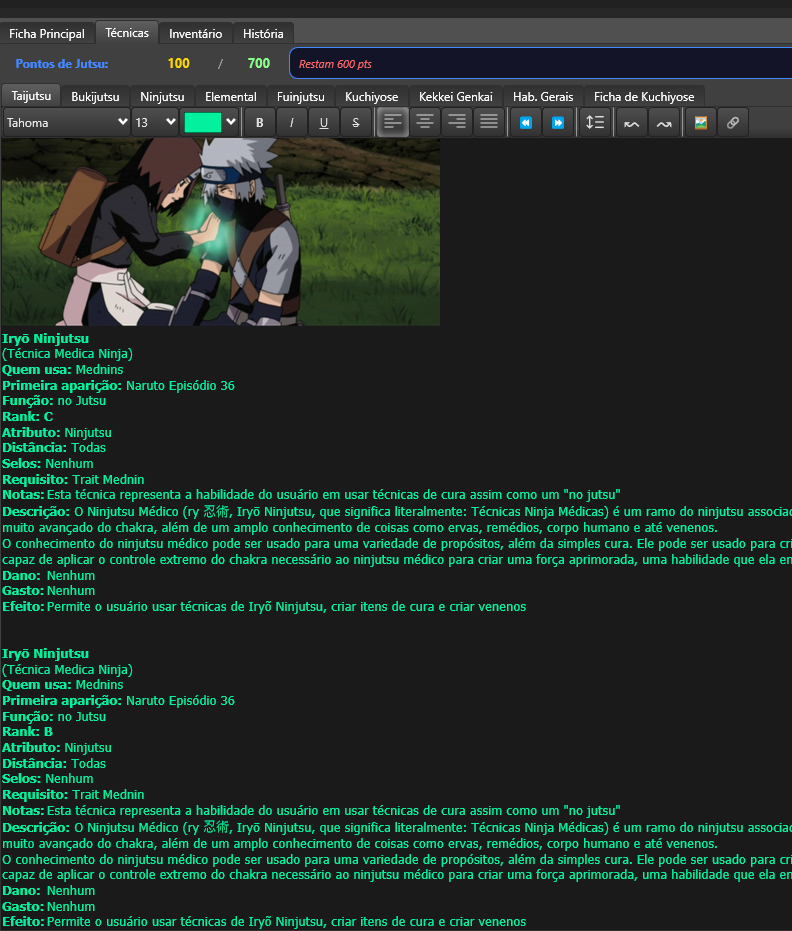
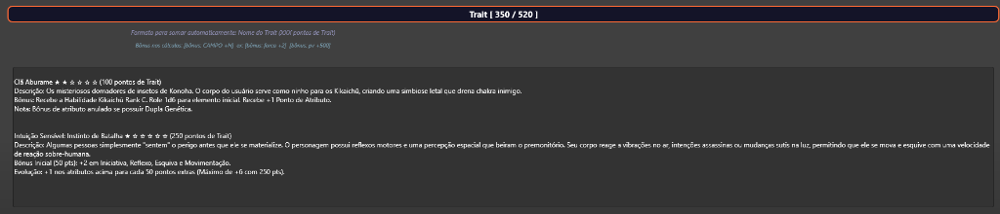

<p align="center">
  
</p>

<h1 align="center">🍥 Naruto Destiny — Ficha de Personagem</h1>

<p align="center">
  <strong>Plugin de ficha de personagem para o RPG Naruto Destiny no <a href="https://firecast.app">Firecast</a></strong>
</p>

<p align="center">
  <a href="https://github.com/Foxoverload/NDPlugins/releases/latest">
    
  </a>
  <a href="https://github.com/Foxoverload/NDPlugins/releases/latest">
    
  </a>
  <a href="https://github.com/Foxoverload/NDPlugins/blob/main/LICENSE">
    
  </a>
</p>

---

## 📖 Sobre

**Naruto Destiny — Ficha de Personagem** é um plugin para o [Firecast](https://firecast.app) que fornece uma ficha completa e automatizada para o sistema de RPG **Naruto Destiny**. A ficha foi projetada com foco em usabilidade, automação de cálculos e uma interface visual rica em tema dark.

O sistema utiliza uma **extensão via Proxy DLL (FCEXT)** que injeta funcionalidades avançadas no Firecast, permitindo uma UI dinâmica e cálculos reativos em tempo real.

---

## 📥 Instalação

### Método 1: Instalação Completa (Ficha + FCEXT) — Recomendado

Este método instala a ficha base **e** o sistema de extensão FCEXT que adiciona cálculos automáticos, elementos toggle, rank automático, etc.

#### Passo 1: Instalar a Ficha Base

1. Baixe o arquivo `Ficha_ND.rpk` na [página de releases](https://github.com/Foxoverload/NDPlugins/releases/latest)
2. Abra o **Firecast**
3. Vá em `Plugins` → `Instalar Plugin` e selecione o arquivo `.rpk`
4. Crie uma nova ficha selecionando o modelo **Naruto Destiny**

#### Passo 2: Instalar o Sistema FCEXT (Extensão Avançada)

1. Na pasta `proxy_dll/`, copie os seguintes arquivos para a pasta do Firecast:

   **Opção A — Usando o instalador (mais fácil):**
   ```
   Clique duas vezes no arquivo proxy_dll/install.bat
   ```

   **Opção B — Manual:**
   
   Copie estes 3 arquivos para `%LOCALAPPDATA%\Firecast\`:
   ```
   proxy_dll/fcext_ficha_nd.lua  →  %LOCALAPPDATA%\Firecast\fcext_ficha_nd.lua
   proxy_dll/fcext_ui.lua        →  %LOCALAPPDATA%\Firecast\fcext_ui.lua
   ```
   
   E copie o proxy DLL para a pasta de instalação do Firecast:
   ```
   proxy_dll/lua54x64_proxy.dll  →  [Pasta do Firecast]\lua54x64.dll
   ```

   > ⚠️ **Importante**: Antes de copiar o DLL, renomeie o `lua54x64.dll` original para `lua54x64_original.dll` como backup.

2. **Reinicie** o Firecast completamente (feche e abra novamente)
3. Abra qualquer ficha Naruto Destiny — as extensões serão carregadas automaticamente

#### Passo 3: Verificar a Instalação

Se a instalação foi bem-sucedida, ao abrir uma ficha você verá:
- ✅ Elementos como **pills coloridos** clicáveis (Katon, Suiton, etc.)
- ✅ **Rank** calculado automaticamente baseado no nível
- ✅ Contador de **Pontos de Jutsu** atualizado em tempo real
- ✅ Seção **Atributos Interpretativos** com contador de pontos

### Método 2: Apenas a Ficha Base (Sem FCEXT)

Se não quiser usar o sistema FCEXT, basta instalar apenas o `.rpk`:

1. Baixe o arquivo `Ficha_ND.rpk` na [página de releases](https://github.com/Foxoverload/NDPlugins/releases/latest)
2. Abra o Firecast → `Plugins` → `Instalar Plugin`
3. Selecione o `.rpk` e pronto

> ⚠️ Sem o FCEXT, os cálculos automáticos avançados (rank, elementos toggle, etc.) não estarão disponíveis.

---

## ❌ Desinstalação do FCEXT

Para remover o sistema FCEXT e voltar ao Firecast original:

**Opção A — Usando o desinstalador:**
```
Clique duas vezes no arquivo proxy_dll/uninstall.bat
```

**Opção B — Manual:**
1. Delete os arquivos `fcext_ficha_nd.lua` e `fcext_ui.lua` de `%LOCALAPPDATA%\Firecast\`
2. Na pasta do Firecast, delete `lua54x64.dll` e renomeie `lua54x64_original.dll` de volta para `lua54x64.dll`
3. Reinicie o Firecast

---

## ✨ Funcionalidades

### 📋 Ficha Completa
- **Dados Pessoais** — Nome, idade, vila, clã, rank shinobi, kekkei genkai e mais
- **Personalidade** — Comportamento, objetivo, sonho, gostos e desgostos
- **6 Slots de Imagem** — Para aparência do personagem
- **Família e Relações** — Pais, irmãos, amigos, inimigos e neutros

### 🌀 Elementos Toggle (FCEXT)
16 elementos ninja como botões clicáveis com feedback visual:

| Básicos | Avançados |
|---------|-----------|
| Katon (Fogo) | Hyoton, Mokuton, Yoton |
| Suiton (Água) | Futton, Shakuton, Ranton |
| Doton (Terra) | Bakuton, Jiton, Shoton |
| Futon (Vento) | Jinton, Enton |
| Raiton (Raio) | |

### ⚔️ Sistema de Combate
- **Atributos Core** — Força, Agilidade, Constituição, Destreza, Controle de Chakra, Concentração, Inteligência e Força Espiritual
- **Atributos de Combate** — Taijutsu, Bukijutsu, Ninjutsu, Genjutsu, Fuinjutsu, Esquiva, Bloqueio e mais
- **Barras de Status** — PV, Chakra e Estamina com valores atuais e máximos

### 🥋 Rank Automático (FCEXT)

O rank é calculado automaticamente baseado no nível:

| Nível | Rank |
|-------|------|
| 0-3 | Estudante |
| 4-9 | Genin |
| 10-19 | Chunin |
| 20-29 | Tokubetsu Jônin |
| 30-39 | Jônin |
| 40-49 | Capitão Jônin |
| 50-59 | ANBU |
| 60-79 | Comandante ANBU |
| 80-89 | Nukenin |
| 90-119 | Oinin |
| 120-139 | Sannin |
| 140-159 | Kage |
| 160+ | Fushi |

### 🧮 Cálculos Automáticos (FCEXT)

#### Pontos de Jutsu
| Rank | Custo |
|------|-------|
| D | 50 pts |
| C | 100 pts |
| B | 150 pts |
| A | 200 pts |
| S | 250 pts |
| SS | 300 pts |
| SS+ | 350 pts |
| SSS / MSS+ | 400 pts |

- Máximo de pontos = **Nível × 100**
- Técnicas marcadas como **(Gratuito)** não são contabilizadas
- Atualização em tempo real via timer de 2 segundos

#### Atributos Interpretativos
- 15 atributos: Sobrevivência, Armadilhas, Empatia, Intimidação, Ladinagem, Enganação, Percepção, Persuasão, Sedução, Medicina, História, Ofício, Conhecimento, Aprendizado, Ensinamento
- **Regra de limites**: 1 atributo max 10 | 2 atributos max 8 | Demais max 7
- Máximo de pontos varia por rank (20 a 50 pontos)
- Correção automática quando limites são ultrapassados

#### Traits
- Parser automático de traits no formato `(XXX pontos de Trait)`
- Detecção de bônus no formato `[bônus: CAMPO +/-N%]`
- Cálculo de pontos usados vs. disponíveis (Nível × 40 + 120)

### 📑 Abas Organizadas
- **Perfil** — Dados pessoais, atributos, combate e traits
- **Atributos** — Atributos core, combate e interpretativos
- **Aparência** — Galeria de imagens e personalidade
- **Técnicas** — 8 categorias de jutsus
- **Inventário** — Editor rich text para itens
- **História** — Background do personagem
- **Kuchiyose** — Ficha completa de invocação

### 🔒 Recursos Extras
- **Travar Ficha** — Impede edições acidentais
- **Exportar como HTML** — Gera arquivo estilizado com todos os dados
- **Ficha de Kuchiyose** — Aba para invocações com atributos próprios

---

## 📸 Screenshots

<details>
<summary><strong>🎯 Aba de Técnicas com Pontos de Jutsu</strong></summary>
<br/>

</details>

<details>
<summary><strong>🌟 Sistema de Traits</strong></summary>
<br/>

</details>

---

## 🛠️ Desenvolvimento

### Pré-requisitos
- [Firecast SDK 3](https://firecast.app/sdk3/) (rdk.exe)
- Editor de texto com suporte a XML/Lua
- Compilador C (para o proxy DLL — opcional)

### Estrutura do Projeto

```
NDPlugins/
├── README.md                 # Este arquivo
├── Ficha ND/                 # Plugin da ficha (formato RPK)
│   ├── FichaND.lfm           # Layout principal (XML + Lua)
│   ├── exportar.lua          # Módulo de exportação HTML
│   ├── cabecalho.xml         # Componente visual de cabeçalho
│   ├── module.xml            # Manifesto do plugin
│   └── output/               # Diretório de build
├── Plugin ND/                # Plugin de combate
│   └── NDCombatPlugin.lfm    # Plugin auxiliar de combate
├── proxy_dll/                # Sistema FCEXT (extensão avançada)
│   ├── fcext_ficha_nd.lua    # Lógica principal da ficha estendida
│   ├── fcext_ui.lua          # Biblioteca de componentes UI
│   ├── lua54x64_proxy.c      # Código-fonte do proxy DLL
│   ├── build.bat             # Script de compilação do DLL
│   ├── install.bat           # Instalador automático
│   └── uninstall.bat         # Desinstalador automático
└── ND Sistema/               # Documentação do sistema ND
    ├── Ficha/                # Regras de criação de personagem
    ├── Jutsus/               # Catálogo completo de jutsus
    ├── Loja de Items/        # Catálogo de itens e equipamentos
    └── Sistema/              # Regras gerais do sistema
```

### Compilando a Ficha

```bash
cd "Ficha ND"
rdk.exe -c
```

O arquivo `.rpk` será gerado no diretório `output/`.

### Compilando o Proxy DLL

```bash
cd proxy_dll
build.bat
```

> Requer compilador C (MSVC ou MinGW) com suporte a x64.

### Tecnologias
- **LFM** (Layout Form Markup) — XML estendido do Firecast para interfaces
- **Lua 5.4** — Lógica de automação, cálculos e exportação
- **Firecast SDK 3** — Framework de plugins
- **NodeDatabase (NDB)** — Persistência de dados do Firecast
- **C (Proxy DLL)** — Extensão de funcionalidades via interceptação de chamadas Lua

---

## 📝 Changelog

### v2.0.0 — Sistema FCEXT Completo
- Sistema Proxy DLL para extensão avançada do Firecast
- Elementos toggle interativos (16 elementos com pills coloridos)
- Rank calculado automaticamente por nível
- Atributos Interpretativos com contador e regra de limites
- Correção de freeze do observer (loop recursivo eliminado)
- Cálculo de jutsus com leitura direta do RichEdit via API
- Timer de 2s para atualização em tempo real
- Biblioteca de UI helpers (fcext_ui.lua)

### v1.2.0 — Redesign Shippuden
- Redesign visual completo com tema Shippuden
- Melhorias na interface do cabeçalho

### v1.1.0 — Shippuden Theme
- Tema visual atualizado

### v1.0.0 — Release Inicial
- Ficha completa com todas as seções
- Cálculo automático de Pontos de Jutsu
- Cálculo automático de Traits
- 6 slots de imagem de aparência
- Exportação HTML
- Sistema de travar ficha
- Ficha de Kuchiyose integrada

---

## 🤝 Contribuindo

Contribuições são bem-vindas! Sinta-se à vontade para abrir issues ou pull requests.

1. Faça um fork do projeto
2. Crie uma branch (`git checkout -b feature/minha-feature`)
3. Commit suas mudanças (`git commit -m 'Adiciona minha feature'`)
4. Push para a branch (`git push origin feature/minha-feature`)
5. Abra um Pull Request

---

## 📄 Licença

Este projeto é de uso livre para a comunidade de RPG Naruto Destiny.

---

<p align="center">
  Feito com 🍥 para a comunidade <strong>Naruto Destiny</strong>
</p>
